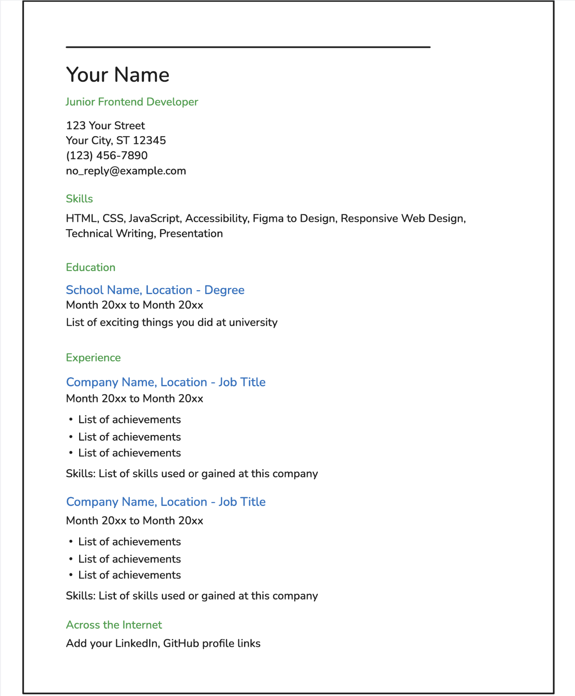
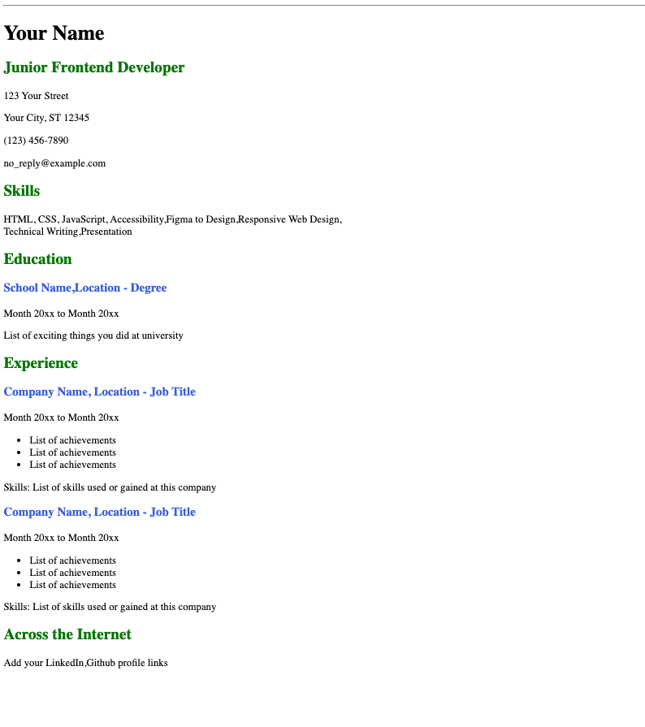

# Currículum vitae de una sola página

---

Prueba sacada de 

---

## Tarea a realizar:

El objetivo de este proyecto es enseñarte a crear un currículum estructurado de una sola página utilizando únicamente HTML. Te centrarás en organizar tu formación académica, habilidades y trayectoria profesional de forma clara y semántica. El diseño se abordará en un proyecto posterior.

En este proyecto, deberá crear un currículum vitae (CV) de una sola página utilizando únicamente HTML. Su página web deberá tener el siguiente aspecto:

## Requisitos clave para este proyecto:

- HTML semántico : Utilice las etiquetas HTML adecuadas para estructurar su currículum.

- Metaetiquetas SEO : Incluya las metaetiquetas esenciales para el SEO.

- Etiquetas Open Graph (OG) : agregue etiquetas OG para compartir mejor en las redes sociales.

- Favicon : Añade un favicon a la página de tu CV.

La estructura de tu currículum debe ser fácilmente comprensible y estar preparada para su adaptación a un proyecto futuro.

## Lista de verificación para la presentación:

- Estructura HTML semánticamente correcta.

- Diseño de una sola página con secciones para educación, habilidades e historial profesional.

- Metaetiquetas SEO en la sección de encabezado.

- Etiquetas OG para compartir mejor en las redes sociales.

- Un favicon vinculado en la sección de encabezado.

---

Al completar este proyecto, adquirirás un sólido conocimiento sobre cómo crear un currículum vitae de una sola página con HTML, aplicar principios básicos de SEO y preparar tu página web para su posterior personalización. Esta base te permitirá aplicar estilos CSS al currículum vitae en proyectos posteriores.

decidi utilizar un style.css para cambiar los colores de los h2,h3

## Resultado

