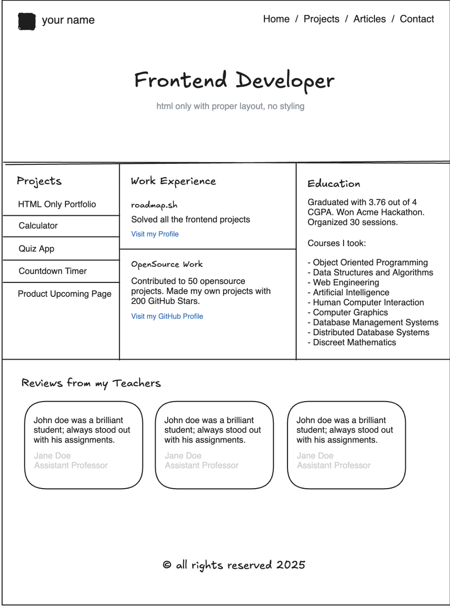
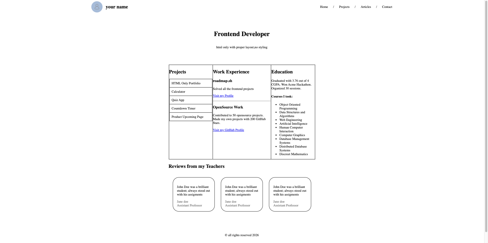
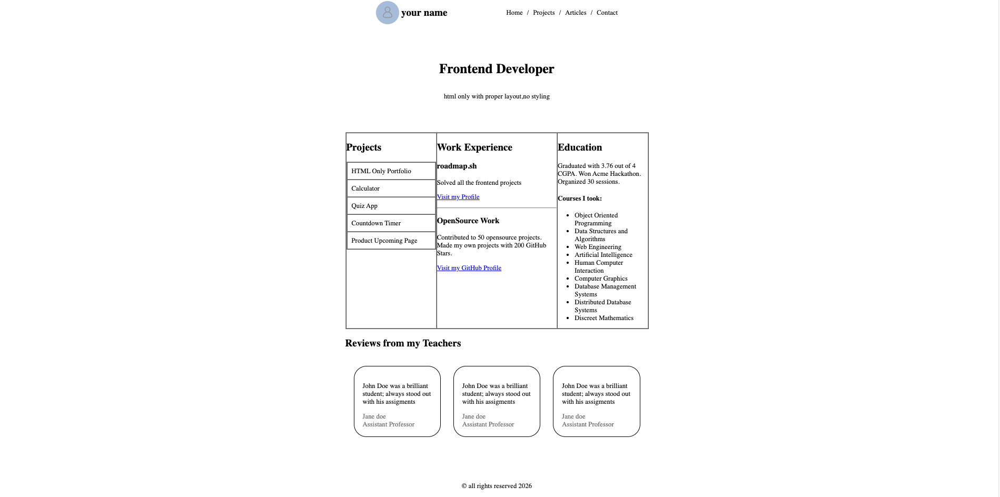

# Sitio HTML Básico

Decidi hacerle unas modificaciones solo para que se viera como la imagen de prueba

## Prueba sacada de roadmap.sh

Esta pagina contiene:

- HTML semantico
- CSS declarado en las etiquetas para hacerlo parecido a la maqueta
- meta tags para SEO

## Maqueta

## Resultado

Usando todo el width de la pantalla en el header:

Colocandolo todo en el centro:

